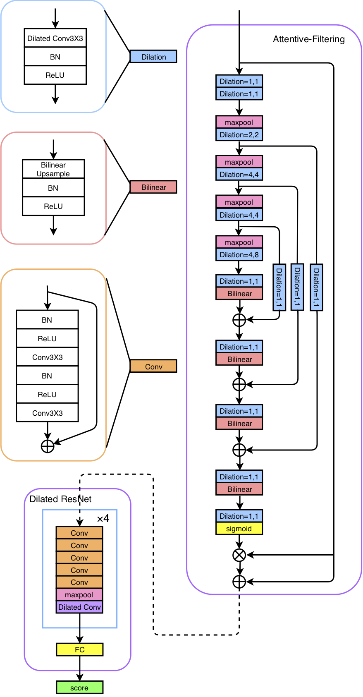

# ASSERT
This repository contains codes to reproduce the core results from our paper (submitted to Interspeech 2019): 
*  

<p align="center">
 
</p>

## Abstract 
We present JHU's system submission to the ASVspoof 2019 Challenge: Anti-Spoofing with Squeeze-Excitation and Residual neTworks (ASSERT). Anti-spoofing has gathered more and more attention since the inauguration of the ASVspoof Challenges, and ASVspoof 2019 dedicates to address attacks from all three major types: text-to-speech, voice conversion, and replay. Built upon previous research work on Deep Neural Network (DNN), ASSERT is a pipeline for DNN-based approach to anti-spoofing. ASSERT has four components: feature engineering, DNN models, network optimization and system combination, where the DNN models are variants of squeeze-excitation and residual networks. We conducted an ablation study of the effectiveness of each component on the ASVspoof 2019 corpus, and experimental results showed that ASSERT obtained more than 93% and 17% relative improvements over the baseline systems in the two sub-challenges in ASVspooof 2019, ranking ASSERT one of the top performing systems. 

## Single Model Benchmark Results
Note: Evaluation key is not released yet, so we only present dev results below. 

|            Model            | PA dev min-tDCF | PA dev EER (%) | LA dev min-tDCF | LA dev EER (%) | 
| :-------------------------: | :-------------: | :------------: | :-------------: | :------------: |
|           SENet34           |   **0.01514**   |   **0.5751**   |     **0.0**     |     **0.0**    |  
|           SENet50           |     0.01709     |     0.6317     |       0.0       |       0.0      |
| Attentive Filtering Network |     0.02096     |     0.7407     |       0.0       |       0.0      |
|        Dilated ResNet       |     0.02377     |     0.7798     |       0.0       |       0.0      |
|        Mean-Std ResNet      |     0.022       |     0.832      |       0.0       |       0.0      |
|          CQCC-GMM           |     0.195       |     9.87       |       0.012     |       0.43     |  
|          LFCC-GMM           |     0.255       |    11.96       |       0.066     |       2.71     |
|       100-i-vectors         |     0.306       |    12.37       |       0.155     |       5.18     |
|       200-i-vectors         |     0.322       |    12.52       |       0.121     |       4.12     |

## Download Pretrained Model Weights
We included the pretrained model weights. We do not plan to release the pretrained models for Mean-Std ResNets. 

*   **SENet34**: 
    `./pretrained/pa/senet34` and `./pretrained/la/senet34`
*   **SENet50**:
    `./pretrained/pa/senet50` and `./pretrained/la/senet50`
*   **Attentive Filtering Network**: 
    `./pretrained/pa/attentive_filtering_network` and `./pretrained/la/attentive_filtering_network`
*   **Dilated ResNet**:
    `./pretrained/pa/dilated_resnet` and `./pretrained/la/dilated_resnet`

## Dependencies
This project uses Python 2.7. Before running the code, you have to install
* [PyTorch 0.4](https://pytorch.org)
* [Sacred](https://sacred.readthedocs.io/en/latest/index.html)
* [Kaldi](https://github.com/kaldi-asr/kaldi)

The former 2 dependencies can be installed using pip by running
```
pip install -r requirements.txt
```

## Getting Started
`./assert/` contains the main source codes, `./baseline/` contains the code for CQCC-GMM, LFCC-GMM and i-vectors, and `./features/` contains acoustic feature extraction codes. 

Make sure to read through the [ASVspoof 2019 webpage](http://www.asvspoof.org) and download the dataset.

## Baselines
`./baseline/` contains code for the CQCC-GMM, LFCC-GMM, and i-vectors baselines. `./baseline/baseline_CM.m` is the official MATLAB script for CQCC-GMM and LFCC-GMM. Make sure to organize the dataset according to the comments within the script. To train the baselines, do 
```
./baseline_CM.sh
```

## Features 
`./features/` contains code for acoustic feature extraction. Follow `./features/run_feature.sh` stage by stage for acoustic feature extraction. Be sure to set up Kaldi and modify `./features/path.sh` to point to your own Kaldi directory. To extract features, do  
```
./run_feature.sh.sh
```

## ASSERT 
`./assert/` contains the code for ASSERT. `./assert/main.py` contains the model training script and model hyperparameters, and `./assert/src/` contains model implementations. To train the models, do
```
python main.py
```
To trian the model on GPU (recommended), do 
```
CUDA_VISIBLE_DEVICES=`free-gpu` python main.py
```
Experiments will be saved automatically by Sacred to `./assert/snapshots/`

## Authors 
Cheng-I Lai, [Nanxin Chen](http://myemacs.com), [Jesús Villalba](https://www.clsp.jhu.edu/faculty/jesus-villalba/), [Najim Dehak](https://engineering.jhu.edu/ece/faculty/najim-dehak/)

If you encouter any problem, feel free to contact me.
